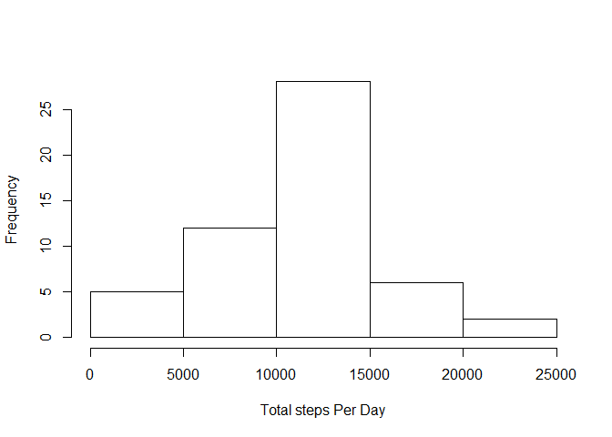
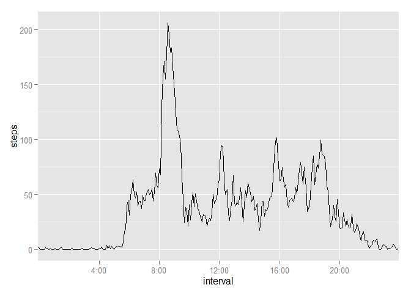
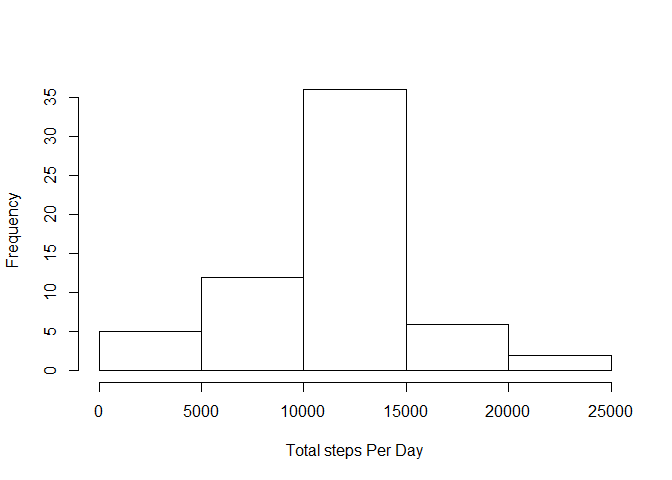
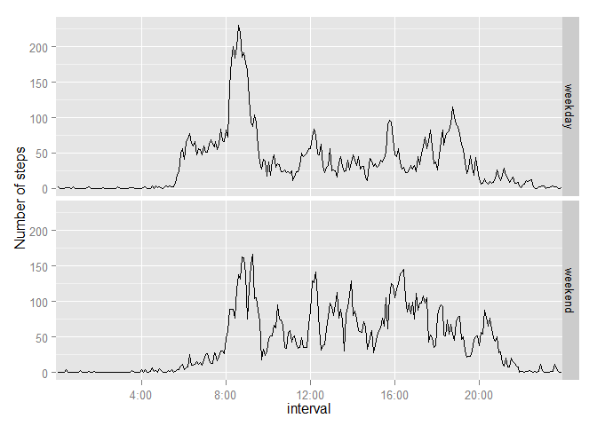

# Reproducible Research: Peer Assessment 1


## Loading and preprocessing the data

```r
library(ggplot2)
df <- read.csv("./data/activity.csv")
df$interval <- as.factor(df$interval)
```

## What is mean total number of steps taken per day?
*1. Histogram of total number of steps taken each day (ignore NAs):*  

```r
# Calculate total steps taken per day
totalPerDay <- aggregate(steps ~ date, data=df, FUN=sum)
hist(totalPerDay$steps, main="", xlab="Total steps Per Day")
```

 

```r
# Calculate mean and median
meanSteps <- formatC(mean(totalPerDay$steps), format="f")
meanSteps
```

```
## [1] "10766.1887"
```

```r
medSteps <- formatC(median(totalPerDay$steps), format="d")
medSteps
```

```
## [1] "10765"
```
*2. The mean total number of steps taken per day is 10766.1887    
The median total number of steps taken per day is 10765*   

## What is the average daily activity pattern?
*1. Plot of 5-minute intervals (x-axis) and the average number of steps taken,*  
*averaged across all days (y-axis)*

```r
# Calulate the mean steps for each interval
interval_avg <- aggregate(steps~interval, data=df, FUN=mean)

# Build the plot, labeling the x-axis
g <- ggplot(interval_avg, aes(interval, steps, group=1)) 
xAxisBreaks <- c(0400, 0800, 1200, 1600, 2000)
xAxisLabels <- c("4:00", "8:00", "12:00", "16:00", "20:00")
g <- g + geom_line() + scale_x_discrete(breaks=xAxisBreaks, labels=xAxisLabels)
print(g)
```

 

```r
# Find the interval with the maximum steps, convert from Factor to numeric
maxStepsFactor <- interval_avg[which.max(interval_avg$steps), "interval"]
maxSteps <- as.numeric(levels(maxStepsFactor))[maxStepsFactor]
maxSteps
```

```
## [1] 835
```
*2. The 5-minute interval, on average across all the days in the dataset,*  
*which contains the maximum number of steps is: 835*

## Imputing missing values

```r
numNA <- sum(is.na(df))
numNA
```

```
## [1] 2304
```
*1. The total number of missing values in the dataset is 2304*  
*2. Replace NAs with the mean for that interval.*   
*3. Create new dataset with the missing values filled in.*  

```r
# Copy the dataset
dfNew <- df
# Fill the column of data with the average for each interval
imputed <- rep_len(interval_avg$steps, nrow(df))
# Add the column of imputed data to the new dataset
dfNew$imputed <- imputed
# Replace the missing data with imputed data
dfNew$steps[is.na(dfNew$steps)] <- dfNew$imputed[is.na(dfNew$steps)]
```

*4. Histogram of total number of steps taken each day:*  

```r
# Calculate total steps taken for each day
totalPerDay <- aggregate(steps ~ date, data=dfNew, FUN=sum)
hist(totalPerDay$steps, main="", xlab="Total steps Per Day")
```

 

```r
# Calculate the mean and median
meanSteps <- formatC(mean(totalPerDay$steps), format="f")
meanSteps
```

```
## [1] "10766.1887"
```

```r
medSteps <- formatC(median(totalPerDay$steps), format="d")
medSteps
```

```
## [1] "10766"
```
*The mean total number of steps taken per day is 10766.1887*      
*The median total number of steps taken per day is 10766*  
*Imputing missing data did not have any effect on the calculations*

## Are there differences in activity patterns between weekdays and weekends?
*1. Add new variable for weekday or weekend*

```r
dayOfWeek <- weekdays(as.Date(dfNew$date))
dfNew$weekend_weekday <- ifelse(dayOfWeek == "Saturday" | dayOfWeek == "Sunday", "weekend", "weekday")
```
*2. Panel plot of the 5 minute interval (x-axis) and the average number of steps taken,*  
*averaged across weekdays or weekend days (y-axis):* 


```r
# Calculate the mean of total steps taken for weekend and weekdays
interval_avg <- aggregate(steps~weekend_weekday+interval, data=dfNew, FUN=mean)

# Build the plot, labeling the x axis
g <- ggplot(interval_avg, aes(interval, steps, group=1)) 
g <- g + geom_line() + facet_grid(weekend_weekday~.) + labs(y="Number of steps") + scale_x_discrete(breaks=xAxisBreaks, labels=xAxisLabels)
print(g)
```

 
